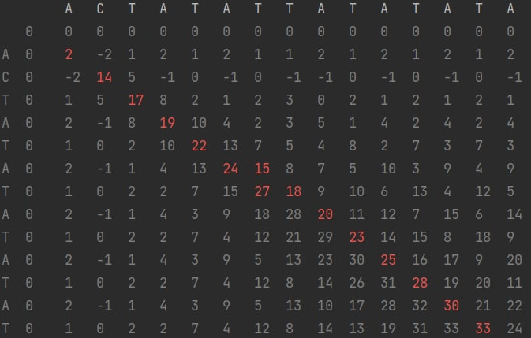
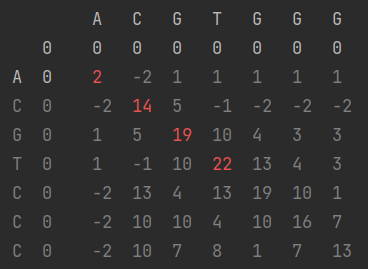

# Protein Sequence Semi-Global and Global Alignment
### Using the Needleman-Wunsch Algorithm
**Developed for my bioinformatics course**

### Features
- pandas or numpy were not used (note: because of that, addressing the matrix is sort of reversed. with \[j\]\[i\])
- direction matrix is not used, so it should have better performance
- colorama for color output
- pytest
  - the test aren't unfortunately exactly unittests (for every function, testing exactly one thing). They're test cases.
    - the benefit of a unittest would've been "if something breaks, you'd know exactly what broke"
    - with test cases you just know "oh, my test cases aren't passing"

- TODO
- customizable gap penalty
- support for multi-path ([unlike this guy's](https://github.com/murk3000/Semi-Global-Allignment/blob/master/semi_glob_allign.py))
- support for global and local alignment:
  - for p in seq1:
  -       sc = sc # add gp for global assignment
  - sc = 0 
  - can be run through both "AlignmentMatrix.py" and "main.py"

## FAQs
### How to use?
> Simply go to the user input section, enter sequences and gap penalty, and run the python code!
### What does the algorithm do?
> It creates a 2D matrix that shows the maximum score possible for the pairwise alignment of two proteins.
Ideally, in a semi-global alignment you would compute forward and backward passes to get the best possible allignment.
In this you only go through a forward pass of the proteins.
With some basic understanding of the code, one could easily modify this to do so.

## Modification
### Turn it into a Global Alignment searcher
1. run the "fill_matrix_starting_gaps" function before running "fill_matrix". It's available, commented, on "main"
2. 
### Gap penalty
### Can local or global alignment be done with this?
> Yes! By following the comments you can insert pieces of code that would do so!