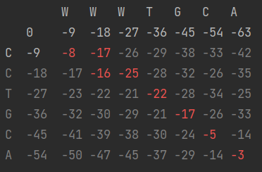

# Local, Semi-Global and Global Alignment for Protein Sequences
### Using the Needleman-Wunsch Algorithm, via the `PAM250` library
**Developed for my bioinformatics course**

# Screenshots
As you can see, it aligns the two strings by making a 2D array. Alignment scores are calculated via `PAM250`.

Semi-Global:

Local:

Global:

### Features
- Libraries like `pandas` or `numpy` were not used 
  - note: because of that, addressing the matrix is sort of reversed. with `\[j\]\[i\]`
- A direction matrix is not used, so it should have better performance
  - One was added later on, but only for printing a colored matrix.
    - The `colorama` was used for color output, imported in the `print_colored_matrix` function
  - It has no time complexity (is calculated while doing the traceback)
- pytest
  - The tests aren't unfortunately exactly unittests (for every function, testing exactly one thing). They're test cases.
    - The benefit of a unittest would've been "if something breaks, you'd know exactly what broke"
    - With test cases you just know "oh, my test cases aren't passing"

## How to

How to use?
> Can be run through tests, `AlignmentMatrix.py` or `main.py`

Get Global or Local Alignment (as it's Semi-Global by default)
> Uncomment the line in `main.py` or `AlignmentMatrix.py`'s run

Get colored output
> Uncomment the line in `main.py` or `AlignmentMatrix.py`'s run

Change gap penalty
> It's a static parameter in the `AlignmentMatrix` class

## Todo
- remove the need for the `colorama` library